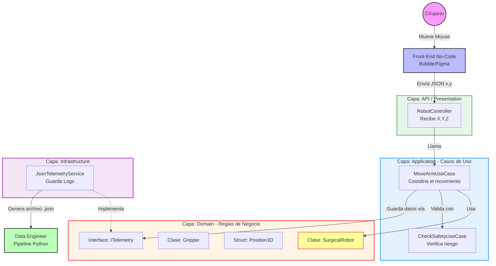
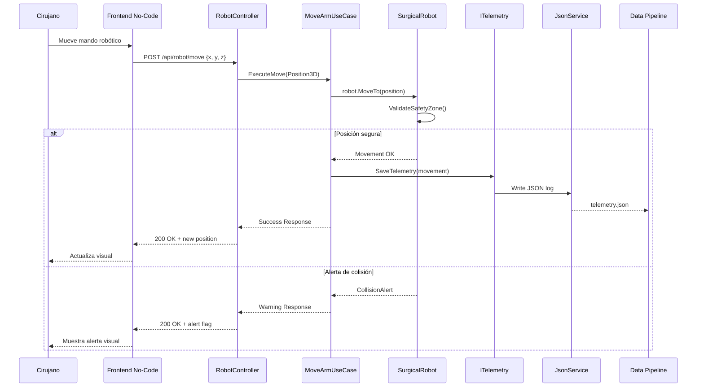

# Clean Architecture
The solution will be structured into the following projects:

## Layer JustinaSimulator.Domain (Class Library)

**Purpose:** The core of the system. Contains enterprise logic and types.  
**Dependencies:** None.  
**Content:** Entities (Robot, Coordinate), Value Objects, Domain Interfaces (IRobotController), Domain Exceptions.

## Layer JustinaSimulator.Application (Class Library)

**Purpose:** Application logic and use cases. Orchestrates the domain.  
**Dependencies:** Domain.  
**Content:** Use Cases/Services (MovePointerService), DTOs (PointerPositionDto), Interfaces (persistence, external services).

## Layer JustinaSimulator.Infrastructure (Class Library)

**Purpose:** Implementation of external concerns (DB, Hardware, IO).  
**Dependencies:** Domain, Application.  
**Content:** Repository Implementations (InMemory for now), Hardware Adapters (Simulated).

## Layer JustinaSimulator.API (ASP.NET Core Web API)

**Purpose:** Entry point for the No Code/Web clients.  
**Dependencies:** Application, Infrastructure.  
**Content:** Controllers, Dependency Injection Config.

---

## Diagrama de Arquitectura

---

## Flujo de Datos Detallado
